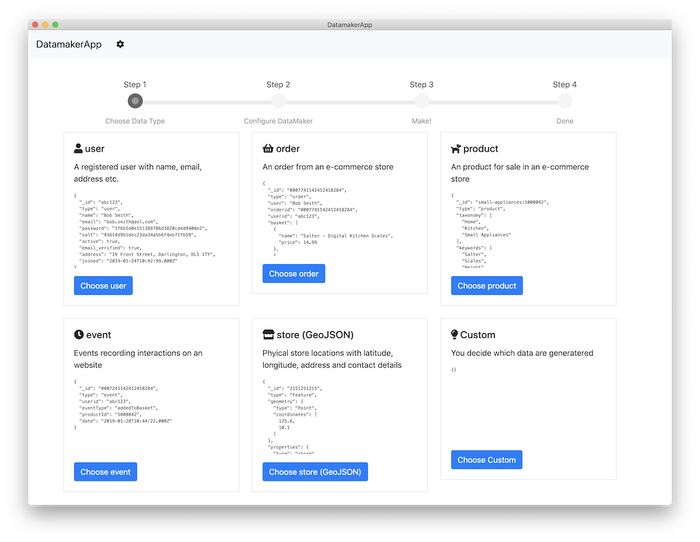

# DataMakerApp

An Electron App that generates sample data for Cloudant/CouchDB databases.



## Prerequisites

Node.js & npm.

## Install

Clone this repository

```sh
git clone https://github.com/glynnbird/datamakerapp.git
cd datamakerapp
```

Install the dependencies

```sh
npm install
npm run postinstall
```

## Run

Run the app with

```sh
npm run start
```

## Build

Build an executable with:

```sh
# build for MacOS
npm run mac
# build for Windows
npm run win
# build for Linux
npm run linux
```